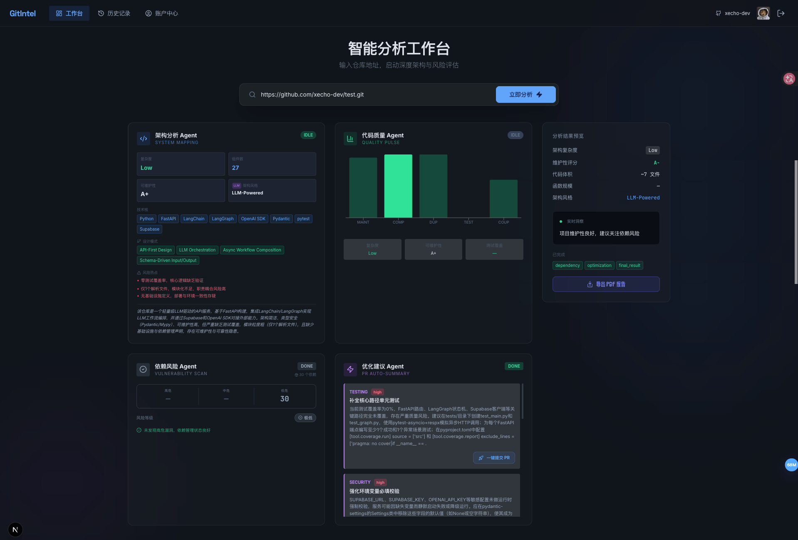
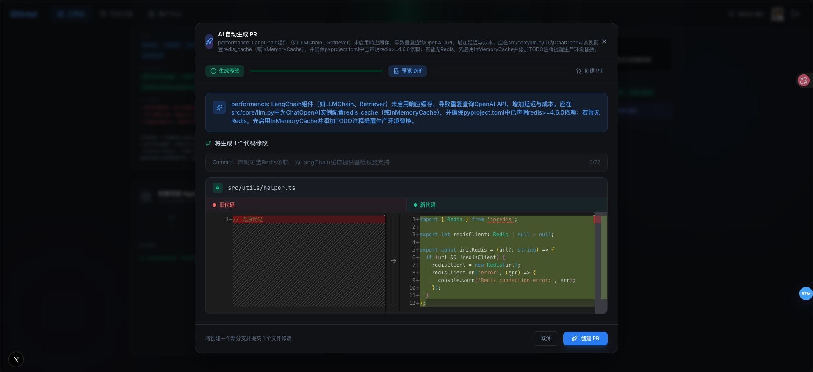

# GitIntel AI Analysis

<div align="center">



### AI 驱动的 GitHub 仓库智能分析工具

对任意公开仓库进行深度扫描，自动输出架构质量、代码健康度、依赖风险和优化建议。

[](https://opensource.org/licenses/MIT)
[](https://nextjs.org/)
[](https://fastapi.tiangolo.com/)
[](https://langchain-ai.github.io/langgraph/)

</div>

---

## 功能特性

| 功能 | 说明 |
|---|---|
| **架构分析** | 解析目录结构与模块组织，生成架构图与组件说明 |
| **代码质量** | 扫描常见代码问题（重复代码、命名规范等），给出健康度评分 |
| **依赖风险** | 分析 `package.json` / `requirements.txt`，识别过时、高风险依赖 |
| **优化建议** | 基于分析结果，给出可落地的代码重构与性能优化建议 |
| **SSE 流式输出** | 分析过程实时推送，用户无需等待完整结果 |
| **历史记录** | 登录用户可保存、浏览、删除分析历史 |
| **GitHub OAuth** | 通过 NextAuth.js + Supabase 完成 GitHub 登录 |
| **健康度评分** | 综合四个维度的评分，以可视化卡片展示最终结果 |

---

## 核心流程

```mermaid
flowchart TB
    %% ===================== 入口 =====================
    A([🚀 请求进入])

    %% ===================== 仓库加载阶段 =====================
    subgraph S1[📦 仓库加载]
        direction TB
        B1[RepoLoaderAgent 获取仓库文件树]
        B2[AI 优先级决策 P0 / P1 / P2]
        B3[加载核心文件]
        B1 --> B2 --> B3
    end

    %% ===================== 代码解析阶段 =====================
    subgraph S2[🧩 代码解析]
        direction TB
        C1[CodeParserAgent AST 解析]
        C2[提取函数 / 类 / 导入关系]
        C1 --> C2
    end

    %% ===================== 并行分析阶段 =====================
    subgraph S3[⚙️ 并行分析]
        direction LR
        D1[TechStackAgent 技术栈识别]
        D2[QualityAgent 代码质量分析]
        D3[DependencyAgent 依赖风险分析]
    end

    %% ===================== RAG 记忆核心 =====================
    subgraph S4[🧠 RAG 记忆核心]
        direction TB
        E1[短期记忆 同仓库历史分析]
        E2[向量检索 相似项目案例]
        E3[知识库 最佳实践]
    end

    %% ===================== 建议生成阶段 =====================
    subgraph S5[💡 建议生成]
        direction TB
        F1[SuggestionAgent 整合分析与RAG上下文]
        F2[生成优化建议与架构洞察]
        F1 --> F2
    end

    %% ===================== 结果存储阶段 =====================
    subgraph S6[💾 结果存储与记忆更新]
        direction LR
        G1[更新短期记忆库]
        G2[更新向量知识库]
        G3[沉淀结构化最佳实践]
    end

    %% ===================== 主流程 =====================
    A --> S1
    S1 --> S2
    S2 --> S3
    S3 --> F1
    F1 --> F2
    F2 --> S6

    %% ===================== RAG 增强关系 =====================
    D1 --> E1
    D2 --> E2
    D3 --> E3
    E1 --> F1
    E2 --> F1
    E3 --> F1
    ```

---

## 分析结果示例



---

## 技术架构

```mermaid
C4Context
    title 系统架构 - GitIntel AI Analysis

    Person(user, "用户", "通过浏览器访问 GitIntel")
    System(frontend, "前端", "Next.js 15", "用户界面 + BFF 层")
    System(agent, "Agent 层", "FastAPI + LangGraph", "并行调度 4 个 Agent 执行分析")
    SystemDb(supabase, "Supabase", "PostgreSQL", "用户数据 & 分析历史持久化")

    Rel(user, frontend, "HTTP / SSE")
    Rel(frontend, agent, "HTTP / SSE")
    Rel(agent, supabase, "读写数据")

    UpdateRelStyle(user, frontend, $offsetY="-40")
    UpdateRelStyle(frontend, agent, $offsetY="40")
    UpdateRelStyle(agent, supabase, $offsetX="-60")
```

### 4 个 Agent

| Agent | 职责 |
|---|---|
| `ArchitectureAgent` | 扫描目录树，识别技术栈，推断分层架构 |
| `QualityAgent` | 检测代码坏味道、圈复杂度、重复片段 |
| `DependencyAgent` | 检查依赖版本、已知漏洞、弃用警告 |
| `OptimizationAgent` | 综合前三者输出结构化优化建议 |

---

## 技术栈

### 前端

| 类别 | 技术 |
|---|---|
| 框架 | Next.js 15 (App Router) |
| UI 样式 | Tailwind CSS v4 |
| 状态管理 | Zustand |
| 动画 | Framer Motion |
| 图表 | Recharts |
| 图标 | Lucide React |
| 认证 | NextAuth.js (GitHub Provider) |
| 数据库客户端 | `@supabase/supabase-js` |

### 后端

| 类别 | 技术 |
|---|---|
| 框架 | FastAPI |
| 工作流 | LangGraph |
| HTTP 客户端 | httpx / litellm |
| 数据验证 | Pydantic v2 |
| 数据库 ORM | Supabase Python Client |
| 部署 | uvicorn (ASGI) |

---

## 目录结构

```
gitintel-ai-analysis/
├── frontend/                 # Next.js 前端（Vercel 部署）
│   ├── app/
│   │   ├── page.tsx          # 首页（输入仓库 URL 开始分析）
│   │   ├── layout.tsx
│   │   └── globals.css
│   ├── components/
│   │   └── Providers.tsx     # NextAuth & Supabase Provider
│   ├── lib/
│   │   ├── api.ts            # BFF 调用（含 SSE 消费逻辑）
│   │   ├── auth.ts           # NextAuth 配置
│   │   └── supabase.ts       # Supabase 客户端
│   ├── store/
│   │   └── useAppStore.ts    # Zustand 全局状态
│   ├── middleware.ts         # 路由中间件
│   ├── next.config.ts
│   └── package.json
│
├── backend/                  # FastAPI Agent 层（独立部署）
│   ├── agents/
│   │   ├── base_agent.py     # Agent 基类（流式输出接口）
│   │   ├── architecture.py   # 架构分析 Agent
│   │   ├── quality.py        # 代码质量 Agent
│   │   ├── dependency.py     # 依赖风险 Agent
│   │   └── optimization.py   # 优化建议 Agent
│   ├── graph/
│   │   ├── state.py          # SharedState 定义
│   │   └── analysis_graph.py # LangGraph 并行工作流
│   ├── middleware/
│   │   └── auth.py           # JWT 鉴权中间件
│   ├── schemas/
│   │   ├── request.py        # 请求 Pydantic 模型
│   │   ├── response.py       # 响应 Pydantic 模型
│   │   └── history.py         # 历史记录模型
│   ├── services/
│   │   └── database.py        # Supabase 数据库操作
│   ├── main.py               # FastAPI 入口，路由定义
│   ├── supabase_client.py    # Supabase 客户端工厂
│   └── requirements.txt
│
├── packages/
│   └── types/
│       └── index.ts          # 前后端共享 TypeScript 类型
│
├── supabase/
│   └── migrations/
│       └── 001_initial_schema.sql   # 数据库建表 SQL
│
├── pnpm-workspace.yaml        # pnpm workspace 配置
├── turbo.json                 # Turborepo 构建流水线
└── package.json              # 根 workspace 元信息
```

---

## 环境变量

### 前端（`frontend/.env.local`）

```env
# Supabase
NEXT_PUBLIC_SUPABASE_URL=https://your-project.supabase.co
NEXT_PUBLIC_SUPABASE_ANON_KEY=your_anon_key

# NextAuth
NEXTAUTH_URL=http://localhost:3000
NEXTAUTH_SECRET=your_nextauth_secret
GITHUB_CLIENT_ID=your_github_client_id
GITHUB_CLIENT_SECRET=your_github_client_secret

# Agent 层（可选，BFF 也可直接用相对路径）
AGENT_API_URL=http://localhost:8000
```

### 后端（`backend/.env`）

```env
# Supabase 服务端密钥（管理后台操作）
SUPABASE_URL=https://your-project.supabase.co

# JWT 鉴权（与 NextAuth JWT Secret 保持一致）
JWT_SECRET=your_jwt_secret
```

> 参考 `.env.example` 文件获取所有变量的完整列表。

---

## 快速开始

### 前置条件

- Node.js ≥ 18
- pnpm ≥ 10
- Python 3.12+
- Supabase 项目（本地或云端）
- GitHub OAuth App（[创建地址](https://github.com/settings/applications/new)）

### 1. 克隆 & 安装依赖

```bash
git clone https://github.com/xecho-dev/GitIntel-AI-Analysis.git
cd gitintel-ai-analysis
pnpm install
```

### 2. 配置环境变量

```bash
cp .env.example .env          # 根目录
cp frontend/.env.example frontend/.env.local
cp backend/.env.example backend/.env
```

按上文填写所有变量的值。

### 3. 初始化数据库

在 Supabase SQL Editor 中执行：

```sql
-- 复制 supabase/migrations/001_initial_schema.sql 的内容粘贴执行
```

### 4. 启动开发服务

```bash
# 同时启动前后端（推荐）
pnpm dev

# 或单独启动
pnpm dev:frontend   # 前端 → http://localhost:3000
pnpm dev:backend     # 后端 → http://localhost:8000
```

---

## API 文档

Agent 层 Swagger 文档（启动后访问）：

```
http://localhost:8000/docs
```

### 核心端点

| 方法 | 路径 | 说明 | 认证 |
|---|---|---|---|
| `GET` | `/health` | 健康检查 | 公开 |
| `POST` | `/api/analyze` | 启动仓库分析（SSE 流式） | JWT |
| `GET` | `/api/history` | 分页获取分析历史 | JWT |
| `POST` | `/api/history/save` | 保存分析结果 | JWT |
| `DELETE` | `/api/history/{id}` | 删除单条历史 | JWT |
| `GET` | `/api/user/profile` | 获取用户资料 | JWT |
| `POST` | `/api/user/profile` | 更新用户资料 | JWT |

### SSE 流式响应格式

每个事件为 JSON 行：

```json
{"type": "status", "agent": "architecture", "message": "正在扫描项目目录...", "percent": 10, "data": null}
{"type": "progress", "agent": "architecture", "message": "目录扫描完成", "percent": 30, "data": null}
{"type": "result", "agent": "architecture", "message": "架构分析完成", "percent": 100, "data": {...}}
...
{"type": "error", "agent": "quality", "message": "Agent 执行失败: ...", "percent": 0, "data": null}
data: [DONE]
```

`type` 取值：`status` | `progress` | `result` | `error` | `done`

---

## 部署

### Docker Compose (推荐)

一键启动所有服务：

```bash
docker-compose up -d
```

### 手动部署

#### 前端 + BFF

```bash
cd frontend
pnpm install
pnpm build
docker build -t gitintel-frontend .
docker run -p 3000:3000 gitintel-frontend
```

需要设置的环境变量：`NEXT_PUBLIC_SUPABASE_URL`、`NEXT_PUBLIC_SUPABASE_ANON_KEY`、`NEXTAUTH_URL`、`NEXTAUTH_SECRET`、`GITHUB_CLIENT_ID`、`GITHUB_CLIENT_SECRET`。

#### 后端

```bash
cd backend
pip install -r requirements.txt
uvicorn main:app --host 0.0.0.0 --port 8000
```

需要设置的环境变量：`SUPABASE_URL`、`JWT_SECRET`。

### Supabase

1. 在 [Supabase](https://supabase.com) 创建项目
2. 在 SQL Editor 执行 `supabase/migrations/001_initial_schema.sql`
3. 获取 `SUPABASE_URL`、填入后端 `.env`

---

## 开发指南

### 添加新的 Agent

1. 在 `backend/agents/` 下新建文件（如 `security.py`）
2. 继承 `BaseAgent`，实现 `stream()` 方法
3. 在 `graph/analysis_graph.py` 中注册并行调度
4. 前端 SSE 消费者无需修改（自动接收新 Agent 事件）

### 修改共享类型

所有跨层类型（`AgentEvent`、`AnalyzeRequest` 等）统一放在 `packages/types/index.ts`，前后端各自导入使用，禁止重复定义。

---

## License

MIT
